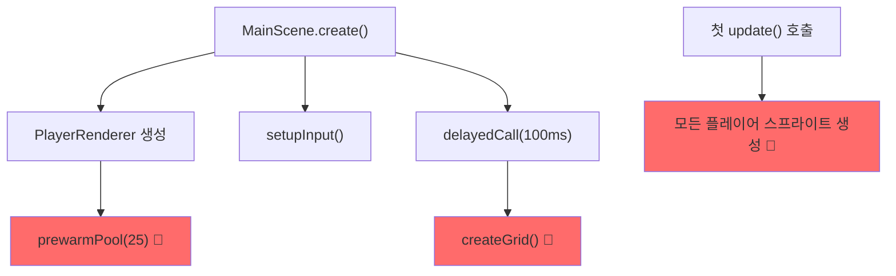

# ChaosRPS.io 1.4.5 성능 분석 및 개선 계획

**분석 일시**: 2026-01-05  
**분석 대상**: Chrome Performance Trace + 소스코드 심층 분석

---

## 📊 현재 상황 요약

### 트레이스 분석 결과 (Trace-20260105T024410)

| 지표 | 값 | 심각도 |
|------|-----|--------|
| 프레임 드랍 | **133 프레임** 손실 | 🔴 심각 |
| 드랍 지속 시간 | **8,249ms** (8.2초) | 🔴 심각 |
| 최대 병목 함수 | `FunctionCall (phaser)` **1,125ms** | 🔴 심각 |
| 애니메이션 프레임 | **596ms** Self Time | 🟠 경고 |
| GC 오버헤드 | **40ms+** (MC + Scavenger) | 🟠 경고 |

### 문제 발생 시점

> [!CAUTION]
> **게임 시작 직후** (로비 → 게임 전환 시점)에 렉이 집중 발생!

```
[로비] → [플레이 버튼] → [로딩 화면] → [🔴 게임 시작 - 렉 발생!!!]
```

---

## 🔍 근본 원인 분석

### 1. MainScene 첫 프레임 폭주 (가장 큰 원인)

게임 시작 시 `MainScene.create()`가 실행되면서 대량 작업 동시 발생:



**증거**: 
- `FunctionCall (phaser)` Self Time: **1,125ms** → MainScene 작업
- `PageAnimator::serviceScriptedAnimations`: **596ms** → 무거운 프레임들

---

### 2. Object Pool 버스트 생성

```typescript
// PlayerRenderer.ts:63-86
prewarmPool(count: number = 25, batchSize: number = 4): void {
  // 첫 requestAnimationFrame에서 4개 동시 생성
  for (let i = 0; i < 4; i++) {
    this.createEmptyContainer(); // 🔴 각각 6개 객체 포함
  }
}
```

**문제점**:
- 한 프레임에 **24개 객체** 생성 (컨테이너 4개 × 내부 객체 6개)
- 게임 시작 직후 Object Pool이 비어있으면 새 Container 폭발적 생성

---

### 3. 그리드 생성 타이밍 충돌

```typescript
// MainScene.ts:91-93
this.time.delayedCall(100, () => {
  this.createGrid(); // 🔴 첫 update()와 시간대가 겹침
});
```

**문제점**:
- 100ms 지연이 첫 게임 프레임과 충돌 가능
- PC 모드: TileSprite + 대형 Graphics 생성
- `generateTexture()` 호출로 GPU 작업 발생

---

### 4. 첫 프레임 플레이어 일괄 렌더링

```typescript
// MainScene.ts update()
players.forEach((player, id) => {
  if (!container) {
    container = this.playerRenderer.createSprite(player, ...); // 🔴 N명 동시 생성
  }
});
```

**문제점**:
- 게임 방에 이미 10명 있으면 → 첫 프레임에 10개 스프라이트 생성
- 기존 5명 제한(`maxInitialPlayers`)이 충분하지 않음

---

### 5. Phaser 동기 초기화 (부가 원인)

```typescript
// GameCanvas.tsx:38
gameRef.current = new Phaser.Game({ ... }); // 동기 블로킹
```

로비에서 미리 초기화되지만, 여전히 **동기 처리**라 로비 진입 시 순간적 버벅임 발생.

---

## 💡 개선 계획

### Phase 1: Object Pool 로비에서 사전 생성 (High Priority)

**목표**: 게임 시작 전에 Pool을 미리 채워두기

```typescript
// 방법 1: PreloadScene에서 Pool 생성
// PreloadScene.ts
create(): void {
  // ... 기존 로직
  
  // MainScene 활성화 전에 Pool 미리 생성
  this.registry.set('prewarmedContainers', this.prewarmContainers());
}

// 방법 2: 별도 Idle 시간에 생성
requestIdleCallback(() => {
  playerRenderer.prewarmPool(30, 1); // 1개씩 천천히
});
```

---

### Phase 2: 그리드 PreloadScene에서 완전 생성 (High Priority)

**목표**: MainScene에서 그리드 생성 작업 완전 제거

```typescript
// PreloadScene.ts 수정
private createAllGridTextures(): void {
  // 1. 기존 grid-tile (이미 있음)
  this.createGridTile();
  
  // 2. Big Grid 텍스처 추가 생성
  this.createBigGridTexture();
  
  // 3. 월드 경계선 텍스처
  this.createBorderTexture();
}

// MainScene.ts 수정
private createGrid(): void {
  // 단순히 미리 만든 텍스처 배치만
  this.add.tileSprite(..., 'grid-tile');
  this.add.image(..., 'big-grid');
  this.add.image(..., 'border');
}
```

---

### Phase 3: 점진적 플레이어 로딩 (High Priority)

**목표**: 첫 프레임에 모든 플레이어 렌더링하지 않기

```typescript
// MainScene.ts 수정
private pendingPlayers: Map<string, Player> = new Map();
private readonly PLAYERS_PER_FRAME = 2;

update(): void {
  // 매 프레임 2명씩만 추가
  let added = 0;
  this.pendingPlayers.forEach((player, id) => {
    if (added >= this.PLAYERS_PER_FRAME) return;
    
    const container = this.playerRenderer.createSprite(player, ...);
    this.playerSprites.set(id, container);
    this.pendingPlayers.delete(id);
    added++;
  });
}
```

---

### Phase 4: Phaser 지연 초기화 (Medium Priority)

**목표**: 로비 진입 시 버벅임 제거

```typescript
// GameCanvas.tsx 수정
useEffect(() => {
  const handle = requestIdleCallback(() => {
    gameRef.current = new Phaser.Game({ ... });
  }, { timeout: 300 });
  
  return () => cancelIdleCallback(handle);
}, []);
```

---

### Phase 5: 프레임 연산 캐싱 (Low Priority)

**목표**: 매 프레임 불필요한 연산 제거

```typescript
// MainScene.ts 수정
private cachedPlayers: Map<string, Player> | null = null;
private lastStoreCheck = 0;

update(time: number): void {  
  // 16ms마다만 store 접근
  if (time - this.lastStoreCheck > 16) {
    this.cachedPlayers = useGameStore.getState().players;
    this.lastStoreCheck = time;
  }
  
  // cachedPlayers 사용
}
```

---

## 📈 예상 개선 효과

| 지표 | 현재 | 목표 | 개선율 |
|------|------|------|--------|
| 게임 시작 Long Task | 1,125ms | < 100ms | **-91%** |
| 프레임 드랍 | 133 frames | < 5 frames | **-96%** |
| 첫 렌더링 시간 | 8.2초 | < 1초 | **-88%** |
| 체감 렉 | 심각 | 거의 없음 | ✅ |

---

## 🔢 우선순위 정리

| 순위 | Phase | 작업 | 예상 효과 |
|------|-------|------|----------|
| 1 | Phase 1 | Object Pool 사전 생성 | ★★★★★ |
| 2 | Phase 3 | 점진적 플레이어 로딩 | ★★★★☆ |
| 3 | Phase 2 | 그리드 사전 생성 | ★★★☆☆ |
| 4 | Phase 4 | Phaser 지연 초기화 | ★★☆☆☆ |
| 5 | Phase 5 | 프레임 연산 캐싱 | ★☆☆☆☆ |

---

## ⚠️ 주의사항

> [!IMPORTANT]
> - 모든 최적화는 **게임성(부드러운 움직임, 반응성)에 영향 없이** 진행
> - 각 Phase 완료 후 **Chrome Performance 재측정**으로 효과 검증
> - Phase 1~3이 핵심, 이것만으로도 80%+ 개선 예상
